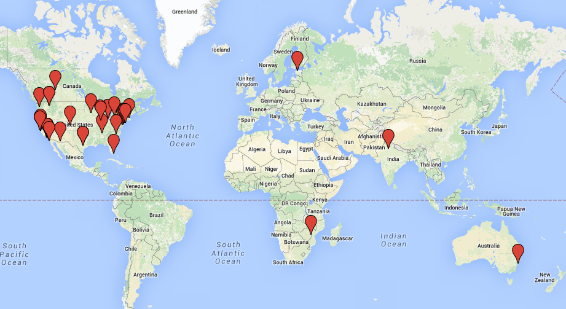
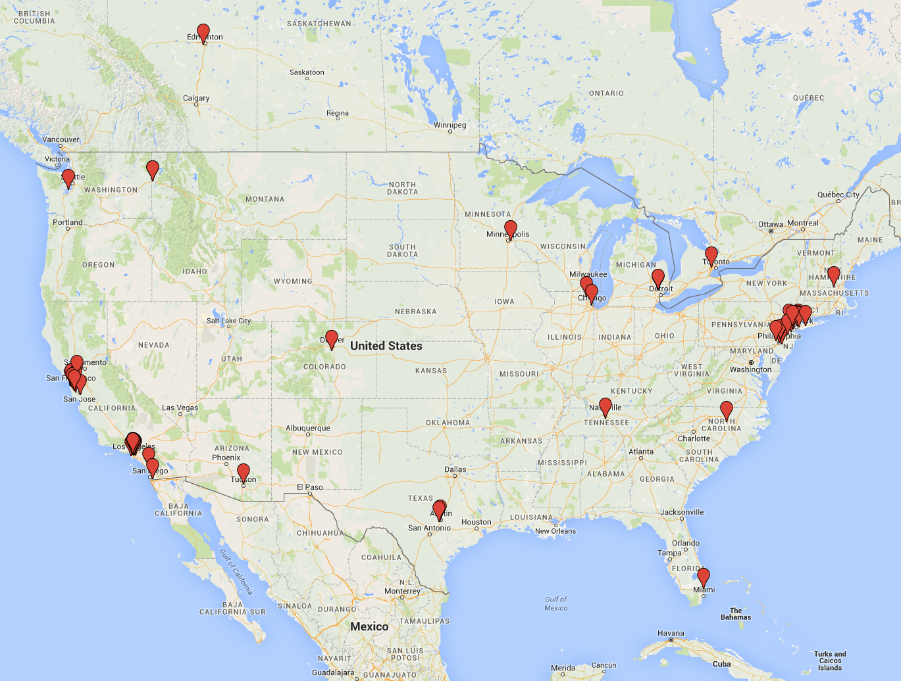

# Hack Club 2015 Update

2015 was an exciting year of growth and learning for Hack Club. Together, with
our club leaders and supporters, we gave more than 1,500 high school students
access to coding clubs. We expanded our reach into new geographies and marked
new frontiers for student-led movements.

Hack Club expanded across the USA and went international. We launched clubs in
Arizona, Colorado, Florida, Idaho, Minnesota, and New Hampshire, bringing Hack
Club to 16 states. We also started Hack Clubs in Australia, Canada, Estonia, and
Zimbabwe. As a result of our work, 6 countries around the world now have Hack
Clubs -- with more to follow.

Thank you for being a part of the Hack Club family. We are humbled every day to
have each and every one of you involved -- our impact would not be possible
without your continued support.

\- Zach

## Quick Stats

- 62 clubs
  - 16 states
  - 6 countries
- 1,500+ club members
- 88 club leaders
- 94.2k messages on Slack since its creation in November
- $145,965 raised

## Stories

What our hackers have to say:

> It is an understatement to say that Hack Club is one of those experiences that
> impacted my life. There’s a strict, obvious contrast with high school: a place
> full of judgment, an environment that devalues creative freedom, an atmosphere
> so lonely with constant glorification of useless issues. It is such a
> wonderful thing to know a place so different from that exists.

Anonymous

> Hack Club has had a huge impact on my confidence. Previously I was shy to talk
> to other people and now I'm leading a club, on my own. Through Hack Club's
> community I've met so many awesome people from across the globe that have
> deeply inspired me -- I truly feel like I'm part of something bigger than
> myself.

Markus Erik Torpel  
Club leader at Merivälja Kool (Tallinn, Estonia)

> This is my club's first year and it's been leaps and bounds better than
> expected. Over the course of the year our more than 80 members have made games
> and websites, participated in hackathons, and have volunteered at a local
> middle school for their hour of code. I started my club after talking to Hack
> Club and can say it wouldn't be a reality if they weren't around.

Raphael Kats  
Club leader at Mundelein High School (Mundelein, Illinois)

> Hack Club has given me the confidence and resources to lead my club. The
> students in my club have learned many skills and some students have even gone
> to hackathons and won prizes! It is an incredible feeling to know that I am
> making a difference in my school and community.

Amy Sorto  
Club leader at Elizabeth High School (Elizabeth, New Jersey)

## Progress

TODO: Flesh out

A year ago, while we were still early into our 24 school pilot, we set out with
the goal to build a reproducible coding club. Since then, we've made great
strides and as of today, we've created a guide for starting clubs, solidified
our curriculum offering, and helped start 38 new Hack Clubs using our resources
(more than doubling our size!). We've had our work featured on The TODAY Show,
in the cover story of The California Sunday, and in the Forbes 30 Under 30.

## Challenges

_Maybe omit this section?_

TODO

- Curriculum hire
- Lack of lawyer
- Time (_I think to myself while writing this at 3am..._)

## Press

TODO: Add description

- Today Show
- California Today
- Norton Ad Campaign
- Daily Dot
- Forbes 30 Under 30
